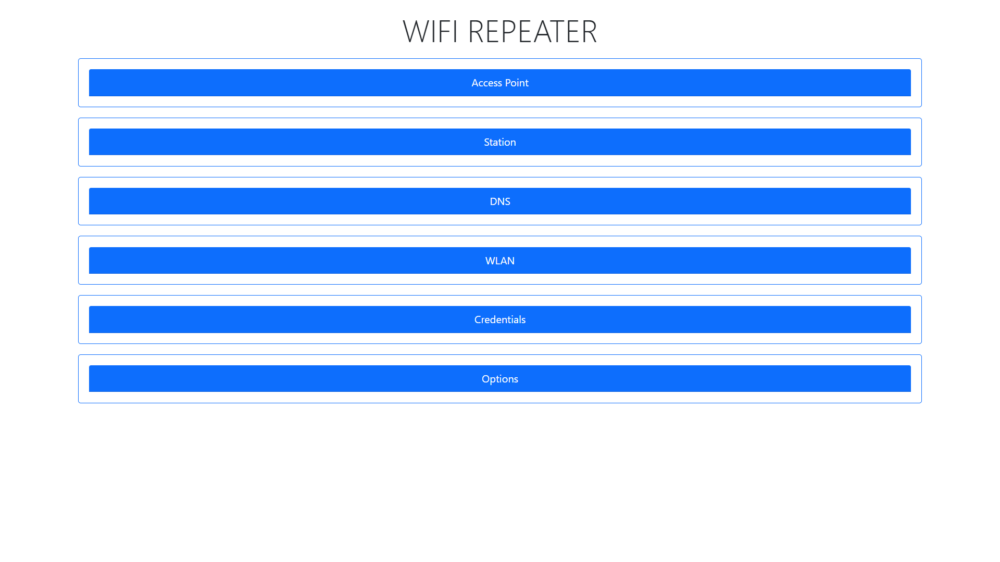

# ESP WiFi Extender

This project enables NAPT feature in ESP8266, so the chip can be used as WiFi range extender. With responsive web interface, the configuration is very easy. Almost the same as most router configuration dashboard.

## How To Use

- Upload the sketch code and web data code 
- Default AP SSID is 'ESP8266 Repeater'. Connect to the network and access 192.168.4.1 in browser
- Log in with username 'admin' and password 'admin' (password can be changed later)
- Set AP and Station (router SSID)
- Done

## Notes
- When uploading use only lwIP Lower Memory Variant and at least 256KB FS
- 160MHz CPU Speed is more recommended
- Changing NAPT table size is not recommended (i think the performance is the same with the default value)
- Use external antenna or modified antenna (soldered wire) for greater stability (and maybe higher speed)
- .gzp is .gz to avoid auto downloading by some external downloader
- To reset settings without dashboard, use serial monitor and send *reset*
- Fast blinking (every 500ms) means no station configured or not connected to station (after booting / disconnected)
- Slow blinking (every 3s) means connected to station

## Performance

Based on iperf3 tests, on average 4-6 Mbps is achievable (with modified antenna). Sometimes on burst it can reach more than 7 Mbps. The latency is roughly the same as the original latency (+ ~5-20ms). On my tests, using modified antenna results in higher speed and signal strength affects the speed a lot